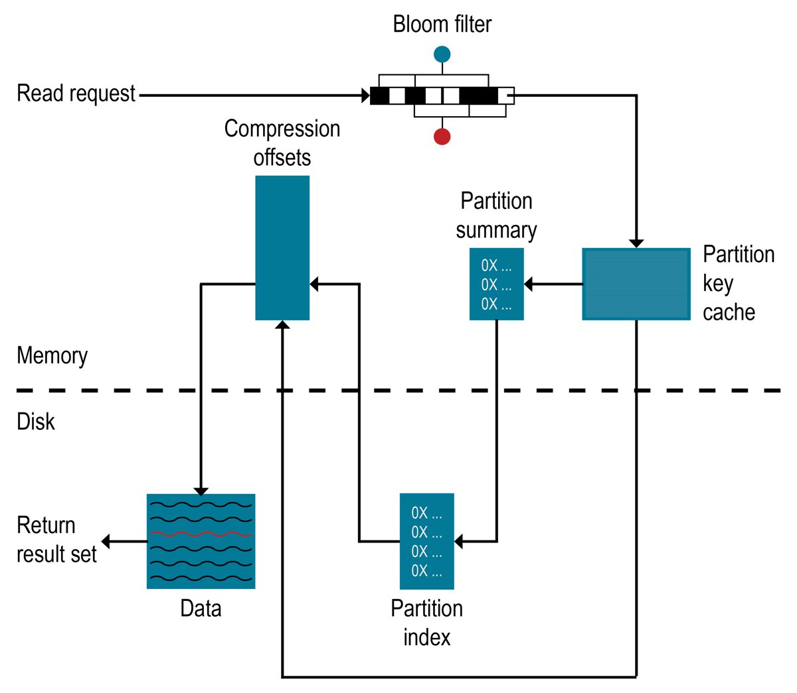

# Week1 Cassandra notes

> Cassandra is a peer-to-peer distributed database that runs on a cluster of homogeneous nodes. Cassandra has been architected from the ground up to handle large volumes of data while providing high availability. Cassandra provides high write and read throughput.  A Cassandra cluster has no special nodes i.e. the cluster has no masters, no slaves or elected leaders. This enables Cassandra to be highly available while having no single point of failure.

* Distributed nosql database. Supports infinite horizontal scaling theoretically.
* Leaderless system. Communication using **gossip protocol**
* Each node in the cluster could have a capacity of 2-4TB.

## Ring network, Coordination and replication

* Request can hit any node in the cluster. That node now takes the role of a **coordinator node**. Coordinator node redirects the incoming data to the nodes owning the partition.
* Each node in the range is in charge of a token range(partition) and each node in the cluster will be responsible for atleast 1 partition.
* Based on the hash value of the incoming data, the coordinator knows to which token range/partition the data should be put in.
* In cluster where we have replication enabled, we will have single node owning multiple partitions. Also each partition data will be replicated in those owning nodes.
* Replication Factor(RF) determines how many nodes will have a partition data replicated. Recommended RF is 3. Each ring can have its own RF.
* When a request hits a node, the node looks up the nodes owning the partition of the data(based on the data's partition key) and will **send the data to all the nodes owning that partition**.
* When one or more nodes owning the partition is down, the coordinator node creates a **hint** to send the data to those currently not available but owning nodes once they are **up/online**. This is self healing mechanism.
* Cassandra can replicate data across clusters. This can help replicate the data globally. Geo redundancy.
* Hybrid cloud and multi cloud supported. Single database can be hosted on clusters in various different clouds as well as onpremise.

## Consistency

* CAP - Consistency, Availability and Partition tolerance.
* CAP theorem - In any distributed system, in case of a failure scenario, we can only guarantee any two of the CAP.
* Cassandra resorts to AP system(Available and partition tolerant) by default. We can configure the cassandra system to be a CP system.
* **Consistency level(CL)** - The number of nodes(replication nodes) that the coordinator has to wait for an acknowledgement.
* CL can be defined for read and write operations separately.
* IF RF = 3 and CL = 1, coordinator will send the data to all the three nodes, but only waiting for write acknowledgement from one of those 3 nodes.
* If`CL=Quorum`, quorum means majority which is given by `(RF/2)+1`. In RF = 3, CL = (3/2)+1 = 2, the coordinator will wait for 2 of write acks.
* CL = ALL, wait for the write acks from all of the replication nodes(which equals RF)
* Only when the consistency level is satisfied(required no of acks received) by the coordinator, the request is signalled as success to the client.
* More the CL, higher the latency of each request.

### Immediate consistency

* When CL = ALL, and we lose a node(lost network connectivity to the coordinator node), immediate consistency comes into picture.

* If `CL(read) + CL(write) > RF`, then we are good to read something immediately that we wrote now. This equation achieves immediate consistency.

* We can define `CL(write) = ALL` and `CL(read)=1` to achieve immediate consistency. But this configuration defeats **high availability**, when the request fails if one of the replicas is not available.

* If we chose `CL(read) = CL(write) =  Quorum`, we can still achieve immediate consistency by also being highly available. This configured is recommended.
* While reading the data from all the replicas, if the coordinator finds out any node having stale data(node that didn't receive update from another coordinator due to network connectivity loss), the read coordinator can automatically repair the stale data(self healing). Stale data identified using checksum.

### Eventual consistency(weaker consistency)

* `CL(read) = CL(write) = 1`. This can be used in cases where when we read the data immediately after write, even stale data is fine. For instance the youtube views or likes on a post can work well with eventual consistency(You need the latency to be minimum on read and write).

## Cassandra use cases

1. Scalability
   * High throughput,high volume data
   * Heavy reads and writes
   * Event streaming scenarios, log analytics, IOT and other time series

2. Highly Availabile scenarios
   * Mission critical
   * No data loss and always on.
   * Scenarios like caching, pricing, inventory, market data.

3. Global distributed database

* Tracking/logistics, customer experience, retail, banking

4. Work on multiple cloud as well as hybrid clouds. Well suited for cloud native applications and microservices.

## Write path

* When a data is sent to a replica node for storing, it is stored in **memtable** which resides in memory and it is appended to commit log which resides in disk.
* Commit log resides in memory and is append only.
* When memtable size is full, it is written to the disk as **SSTABLE** which is immutable. After that commit log and memtable are cleared and only **SSTable** exists
* We will have an SSTABLE created everytime the memtable is full.
* When an entry alread gets updated, cassandra will have multiple versions  of the same record possibly in different **SSTABLE** and it will always fetch the latest record.
* If a column based ordering is already specified while creating the table, the records are inserted in that order in the memtable. So when we fetch data, the data is already ordered by that column.

## [Read path](https://docs.datastax.com/en/ddac/doc/datastax_enterprise/dbInternals/dbIntAboutReads.html)

* Request for reading data first looksup in the memtable. If found returns the record.
* If not found in the memtable, we will have to look up from the list of SSTABLES. But remember SSTABLES are in disk(compressed and stored). So scanning each SSTABLE will make read a lot slower.
* There is a **partition key cache(RAM and off heap)**, which is a cache of recently fetched partitions. If we found the entry in the paritition key cache, we can get the offset in the SSTABLE directly.
* SSTable holds ordered partitions. A partition can be split in multiple SSTables. To find the record in the SSTABLE, we have various look up tables like partition.
* Partition index and partition summary are per SSTABLE
* **Partition Index look up table** stores the byte offset of each partition in a SSTABLE. **This table is stored on disk**. Since a single SSTABLE can be large, the partition index table will also have many entries.
* **Partition summary table** is stored in RAM (on off-heap) and it stores a token range and its start offset in the partition index look up table. This table makes easier to reach the partition entry in the partition index table(remember partition index is stored on disk and loading the entire table inmemory to find the partition offset will be costly).

### Bloom filter

* Each SSTable has an associated **Bloom filter**, which can establish that an SSTable does not contain certain partition data.
* The Cassandra database checks the Bloom filter to discover which SSTables are likely to have the requested partition data.
* If the Bloom filter does not rule out an SSTable, the Cassandra database checks the partition key cache. Not all SSTables identified by the Bloom filter will have data.
* Because the Bloom filter is a probabilistic function, it can sometimes return false positives.The Bloom filter is stored in off-heap memory.


## Cassandra data model

* Keyspaces contains tables. Keyspace is analogous to database in RDBMS.
* Tables contains rows and columns.
* Groups of rows are called partitions that are stored in a node or replica nodes owning that partition. Hence a table can have many partitions(that can reside on many nodes). Due to this reason, `select * from table` is considered an antipattern
* Each row contains a partition key which can be a column or group of columns hashed to obtained that node to store the record/row.
* Each row contains partition key columns, clustering columns(sorting purposes) and data columns.

## Selecting partition keys

* Avoid too big partitions. Partitions with > 100,000 records or > 100MB in size are generally considered big partitions.
* Single record not recommended to hold more than 10MB

## Creating keyspaces

```Cql
CREATE KEYSPACE users
WITH REPLICATION = {
    'class' : 'NetworkTopologyStrategy', -- replication strategy
    'datacenter1': 3  -- replication factor
};
```

---

## References

* [Week1- Getting Started with Cassandra](https://www.youtube.com/watch?v=y4Gt_LQ8sdA)
